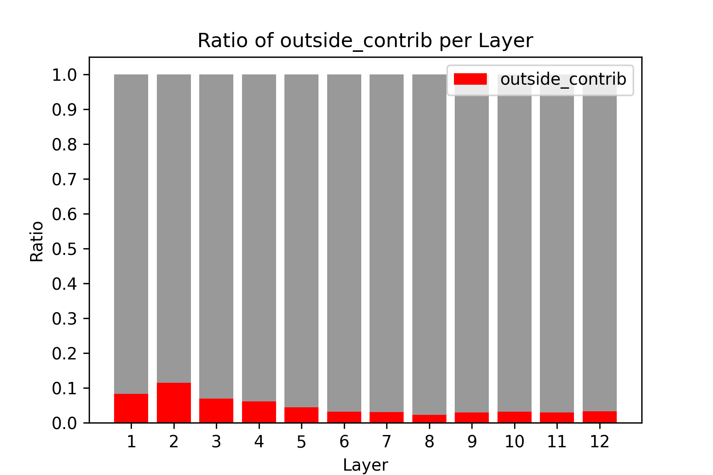
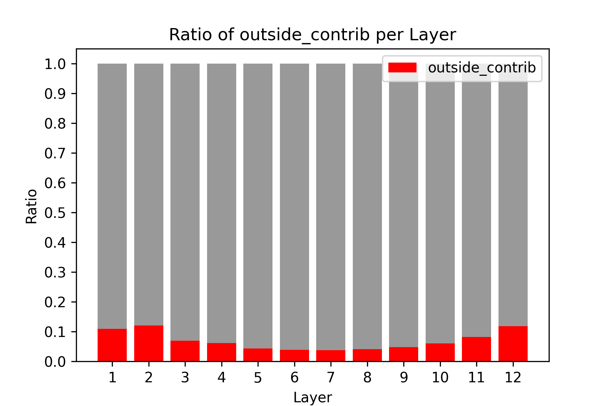
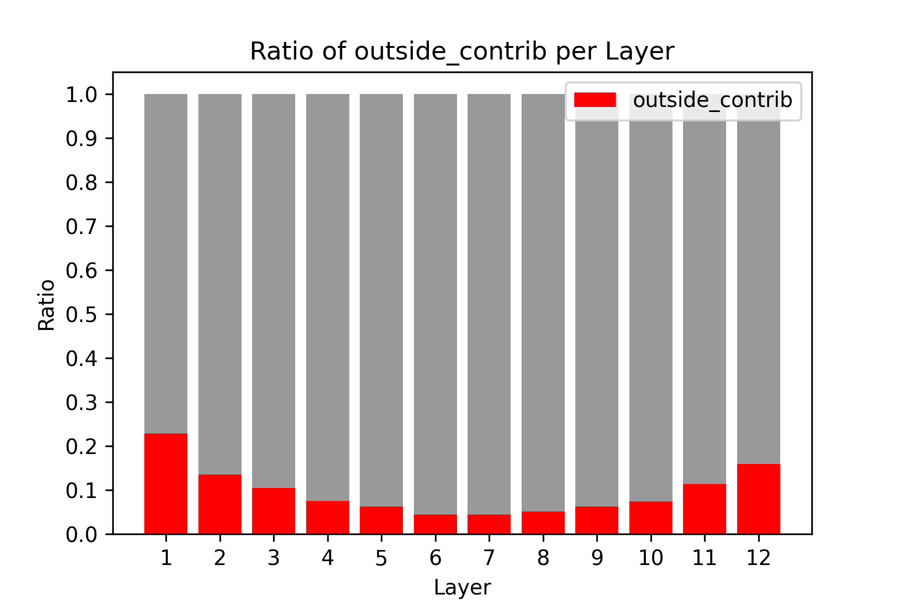

# Improving Character-Level Transformer Language Models with Patches of Characters

## Method

In this project, I designed an improvement of character-level transformer language models. The idea is to first obtain patch-level embeddings by pooling the character-level embeddings with a strided convolution. The patch embeddings are processed by the same transformer layers as the character embeddings. After each transformer block, the patches are unpooled with a transposed convolution to match the shape of the character embeddings, and they are added to the character embeddings. This way, we incorporate more abstract information with higher range into the character embeddings, without losing fine-grained information. The processing of the patches can be seen as residuals which perform more abstract and coarser computation. This model can also be seen as a U-Net-like transformer architecture but with only two levels of hierarchy (but could be extended to more levels), and where these levels are all processed at the same time, in parallel, and synchronized after each transformer block.

This model aims at improving the performance of the transformer by greatly facilitating abstract computation through patches. It also extends the effective context size almost for free, as the patches are coarser and thus have higher range in character units. For example, with a patch size of 2, the effective context size is doubled.

## Code

The code is modified from [karpathy/nanoGPT](https://github.com/karpathy/nanoGPT).
- model.py / model2.py defines the vanilla / improved transformer model.
- train.py / train2.py contains the training script for the vanilla / improved transformer.
- test.py / test_2.py contains the testing script for the vanilla / improved transformer.
- sample.py / sample2.py contains a script for sampling from the vanilla / improved transformer.

## Experiments

The dataset used in the experiments is enwik8, which contains 100M bytes from English wikipedia pages, split into 90M, 5M, and 5M for respectively the training, validation, and testing sets.

Here is a table comparing the vanilla transformer, which serves as the baseline, and our improved transformer. The performance metric is bits per byte (bpb) (lower is better). "bs" stands for batch size and "ps" for patch size.

| Model                     | Num tokens   seen per iter | Parameters | Training time   for one L4 GPU | bpb   |
|---------------------------|-------------------------------|------------|-----------------------------------|-------|
| nanoGPT   bs=16        | 16k                           | 38M        | 12h                               | 1.148 |
| New model   ps=2-bs=8  | 16k                           | 45M        | 19h                               | 1.127 |
| New model   ps=2-bs=16 | 32k                           | 45M        | 38h                               | 1.112 |
| New model   ps=4-bs=16 | 65k                           | 52M        | 50h                               | 1.096 |

We can see that our new model is better, but at the expense of longer training time and more parameters due to the additional convolutions and transposed convolutions. Furthermore, I believe the baseline can further be improved with more training iterations, so the comparison might not be entirely fair. With this in mind, we can still observe a significant improvement when we incorporate patch-level information into the character embeddings.

## Visualizations

Next, I assessed to what extend information from outside the current context window is incorporated into the character embeddings through the patch embeddings which possess higher range. To do this, I calculated the amount of attention paid by the patches outside the context window, and the amount of information transferred from the patch embeddings to the character embeddings, defined as the ratio of the standard deviation of the patch embeddings divided by the total standard deviation. These two quantities are multiplied together to obtain the amount of information incorporated from outside the context window into the character embeddings. Here are the bar plots visualizing this quantity for each transformer layer and each model configuration:

<table>
  <tr>
    <td align="center">
      <h> ps=2-bs=8 </h>
       
      
    </td>
    <td align="center">
      <h> ps=2-bs=16 </h>
       
      
    </td>
    <td align="center">
      <h> ps=4-bs=16 </h>
       
      
    </td>
  </tr>
</table>

From these plots, we can see that the patches bring information from outside the current context window into the characters, which could explain parts of the improved performance from our model.